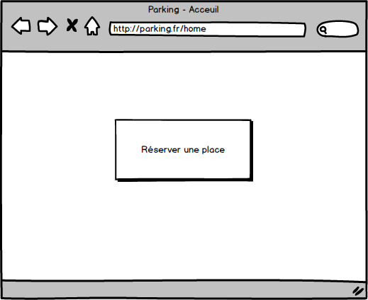

#Technologies utilisés
##Documentation
* MCD : MOCODO
* Maquettes : Balsamiq

##Création
* Base de données : MariaDB
* Back-end : PHP 7.2 (Framework : Laravel)
* Front-end : HTML5 / CSS3 / Bootstrap
* Outil de versionning : Git

##Présentation
* Projection : PowerPoint

#Liste des taches
##Mise en place
- Installation du seveur web correspondant au projet
- Installation de Laravel
- Création de la BDD suivant le pattern du MCD
- Mise en ligne du projet sur Github

##Création
- Ajout des models utilisateur et parking
- Ajout d'une fonction envoi de mail
- Création d'un formulaire d'inscription 
	- Envoi d'un mail pour confirmer l'addresse mail
	- Mise en attente de la confirmation de l'administrateur
- Création d'un formulaire de connexion
	- Stocker le status / nom / id de l'utilisateur dans le navigateur
- Création d'un formulaire en cas de mot de passe oublié
	- Envoi d'un mail contenant un lien pour réinitialiser le mot de passe
- Création de la page d'accueil contenant trois variante :
	- Possibilité de réserver une place
	- Affichage de la place réservé
		- Ajout de la possibilité d'annuler la place réserver
	- Affichage du rang dans la file d'attente
		- Ajout de la possiblité de sortir de la file d'attente
- Création de la page administration deux variantes possible :
	- Gestion des utilisateurs
		- Ajout de la possiblité de Supprimer un utilisateur
		- Lien vers un formulaire de modification contenant les informations de l'utilisateur
		- Lien vers un formulaire d'ajout
	- Gestion des places
		- Ajout de la possibilité de retirer la place à un utilisateur
		- Gérer le nombre de place disponible
		- Gérer le temps d'affectation d'une place
		
- Création de la page paramètre de l'utilisateur permettant la modification du mot de passe

#Représentation graphique
##Arborescence web

##Modèle conceptuel de données

##Maquettes des pages
###Inscription 

###Connexion 

###Acceuil (Réservation) 

###Acceuil (Attente) 

###Acceuil (Place) 

###Administration 

###Administration Users 

###Administration Places 
