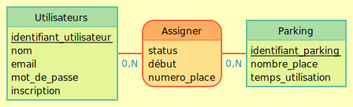

#Technologies utilisés
##Documentation
* MCD : MOCODO
* Maquettes : Balsamiq
##Création
* Base de données : MariaDB
* Back-end : PHP 7.2 (Framework : Laravel)
* Front-end : HTML5 / CSS3 / Bootstrap
* Outil de versionning : Git
##Présentation
* Projection : PowerPoint

#Liste des taches
##Mise en place
- Installation du seveur web correspondant au projet
- Installation de Laravel
- Création de la BDD suivant le pattern du MCD
##Création
- Ajout des models utilisateur et parking
- 

#Représentation graphique
##Arborescence web

##Modèle conceptuel de données

##Maquettes des pages
###Inscription 

###Connexion 

###Acceuil (Réservation) 

###Acceuil (Attente) 

###Acceuil (Place) 

###Administration 

###Administration Users 

###Administration Places 
